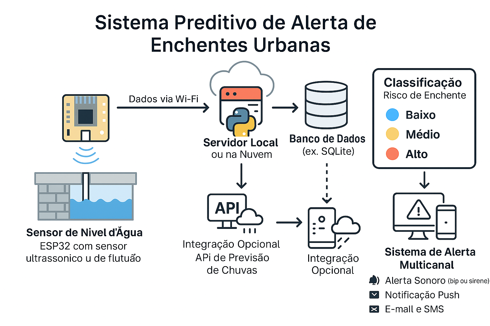

# 🌊 Sistema Preditivo de Alerta de Enchentes Urbanas

Este projeto propõe uma solução digital integrada para prever e alertar, em tempo real, riscos de enchentes urbanas em regiões críticas do Brasil. Combinando sensores de nível d’água (ESP32), análise de dados meteorológicos e Machine Learning, o sistema classifica o risco e aciona alertas conforme a gravidade.

---

## 🎯 Objetivo

Desenvolver um sistema inteligente que utilize sensores físicos e algoritmos de Machine Learning para classificar riscos de enchente e emitir alertas em tempo real, apoiando a resposta em regiões críticas do Brasil.

---

## 🌍 Contexto do Problema

Eventos de enchente em centros urbanos brasileiros têm causado mortes, prejuízos e caos em áreas vulneráveis. Tragédias como as de Porto Alegre (2024), Petrópolis (2022) e Recife (2023) evidenciam a necessidade de sistemas preditivos integrados a sensores e dados climáticos.

---

## ⚙️ Tecnologias Utilizadas

| Tecnologia | Aplicação |
|------------|-----------|
| Python + Scikit-learn | Treinamento e aplicação do modelo preditivo |
| Flask | API de recebimento de dados |
| ESP32 + sensor de nível d’água | Coleta de dados em tempo real |
| SQLite | Armazenamento de leituras e classificações |
| R + ggplot2 | Visualização estatística dos dados históricos |
| GitHub | Versionamento e entrega do projeto |
| Postman | Teste de endpoints da API |
| API meteorológica (opcional) | Dados complementares de chuva |

---

## 🧠 Funcionalidades

- Recebe dados de sensores de nível d'água (simulado com ESP32)
- Prediz automaticamente o nível de risco: **baixo**, **médio** ou **alto**
- Registra histórico de alertas em:
  - 📄 `logs.txt` (modo texto)
  - 🗃️ `banco_dados.sqlite` (modo estruturado)
- Gera alertas com níveis personalizados
- Visualiza gráficos em R (`analise_alertas.R`)
- Executa modelo treinado (`modelo_risco_enchente.joblib`)
- Envia e processa dados com API Flask (`POST /nivel`)

---

## 🧱 Arquitetura do Sistema



1. Coleta de dados via sensor ESP32
2. Envio via Wi-Fi para servidor local
3. Inferência via modelo ML (DecisionTree)
4. Armazenamento no SQLite
5. Geração de alerta + logging
6. Visualização estatística (opcional com R)
7. (Futuro) Integração com APIs climáticas

---

## 📁 Estrutura do Projeto

```plaintext
=======
## 🗂️ Estrutura do Projeto

📂 alerta_enchente_br/
├── 📁 docs/
│   └── arquitetura_sistema.png
├── 📁 database/
│   └── banco_dados.sqlite
├── 📁 modelo_ml/
│   ├── modelo_risco_enchente.joblib
│   ├── preditor.py
│   └── treino_modelo.py
├── 📁 sensores/
│   └── esp32_sensor_nivel.ino
├── 📁 utils/
│   ├── alerta_medio.mp3
│   ├── alertas.py
│   └── sirene_alerta.mp3
│   └── alertas.py
├── 📄 analise_alertas.R
├── 📄 logs.txt
├── 📄 main.py
├── 📄 requirements.txt
├── 📄 README.md
```

## 🚀 Como Executar Localmente

1. Clone o repositório:

```bash
git clone https://github.com/araujo-mauricio/gs2025_alerta_enchente.git
cd alerta_enchente_br
```

2. Instale os pacotes:

```bash
pip install -r requirements.txt
```

3. Inicie o sistema:

```bash
python main.py
```

---

## 🔬 Testando a API com Postman

- Método: `POST`
- Endpoint: `http://localhost:5000/nivel`
- Body (JSON):
```json
{
  "nivel_cm": 88,
  "chuva_mm": 25
}
```

Verifique:
- Terminal
- `logs.txt`
- `banco_dados.sqlite`

---

## 📊 Classificação dos Alertas e Disparos

Abaixo, apresentamos a tabela de ações associadas a cada nível de risco:

| Risco       | Disparo Sonoro     | Push Notification | SMS     | E-mail              | Frequência              | Público-Alvo                         |
|-------------|--------------------|-------------------|---------|---------------------|--------------------------|--------------------------------------|
| 🔵 Baixo    | ❌ Não              | ❌ Não            | ❌ Não  | ✔️ Relatório diário | 1x ao dia (opcional)     | Equipe técnica, prefeituras          |
| 🟡 Médio    | ✔️ Simples bip     | ✔️ Sim            | ❌ Não  | ✔️ Relatório resumido | A cada detecção         | Defesa Civil local, operadores       |
| 🔴 Alto     | ✔️ Sirene intensa  | ✔️ Sim            | ✔️ Sim  | ✔️ Detalhado e urgente | Imediato                | Defesa Civil, prefeituras, moradores |

As decisões de disparo são tomadas **automaticamente pelo sistema**, com base na predição do modelo de Machine Learning.

---

## 📊 Análise com R

Execute o arquivo `analise_alertas.R` no RStudio para:

- Ver frequência dos riscos
- Visualizar evolução do nível d’água
- Conectar ao banco `banco_dados.sqlite`

---

## 🔗 Fontes de Dados

- 🌐 https://disasterscharter.org (ex: Ativação 816 – Porto Alegre, 2024)
- ☔ INMET, CEMADEN, ANA – Dados meteorológicos de chuva

---

## 🎬 Demonstração em Vídeo

🔗 [Assista ao vídeo da solução (YouTube - não listado)](https://youtu.be/EXEMPLO)

---

## 👨‍💻 Equipe

- Mauricio Araújo – RM566040  
- Igor Herson – RM563980  


---
FIAP · Fase 4 · Global Solution 2025.1

---
